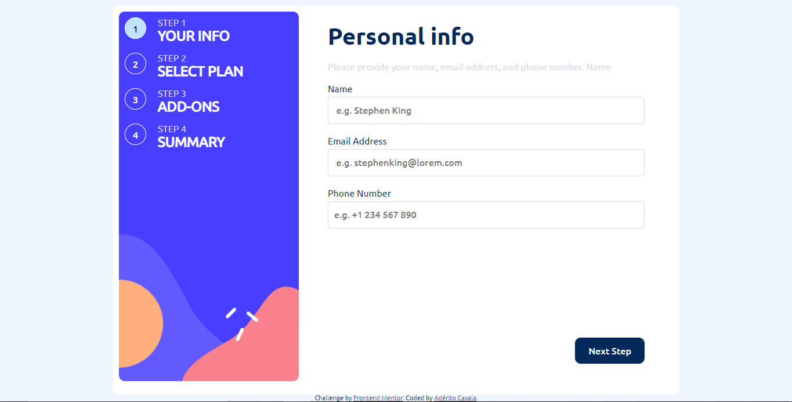
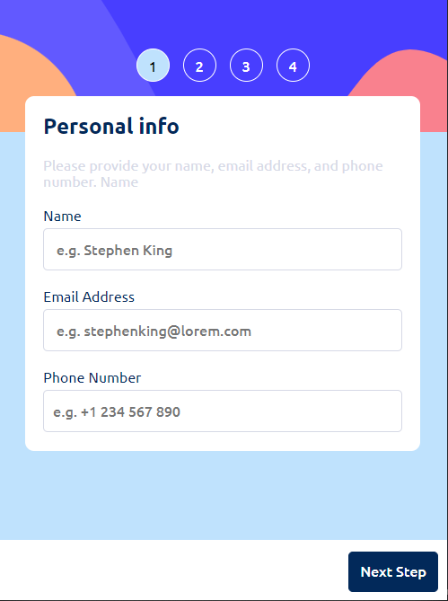

# Frontend Mentor - Multi-step form solution

This is a solution to the [Multi-step form challenge on Frontend Mentor](https://www.frontendmentor.io/challenges/multistep-form-YVAnSdqQBJ). Frontend Mentor challenges help you improve your coding skills by building realistic projects. 

## Table of contents

  - [The challenge](#the-challenge)
  - [Screenshot](#screenshot)
  - [Links](#links)
  - [Built with](#built-with)
  - [What I learned](#what-i-learned)
  - [Continued development](#continued-development)
  - [Author](#author)

### The challenge

Users should be able to:

- Complete each step of the sequence
- See a summary of their selections on the final step and confirm their order
- View the optimal layout for the interface depending on their device's screen size
- See hover and focus states for all interactive elements on the page

### Screenshot

### Links

- Solution URL: [here](https://github.com/Heliandro1/multi-step-form-main)
- Live Site URL: [here](https://heliandro1.github.io/multi-step-form-main/)

### Built with

- Semantic HTML5 markup
- CSS custom properties
- Flexbox
- Mobile-first workflow
- JavaScript

### What I learned

While building this sensacional front-end project I could improve my HTML, CSS and JavaScript skills and always thinking in how to keep my code clear and easy to read 

### Continued development

I want to continue improving my front-end skills and learn about another areas of web development

## Author
- Frontend Mentor - [@heliandro1](https://www.frontendmentor.io/profile/heliandro1)
- Linkedin - [@adérito-caxala](https://www.linkedin.com/in/adérito-caxala)
- Instagram - [@heliandro_10](https://www.instagram.com/heliandro_10)
- Facebook - [@Heliandro](https://www.facebook.com/heliandro.1)